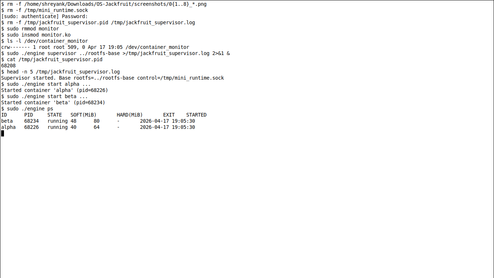
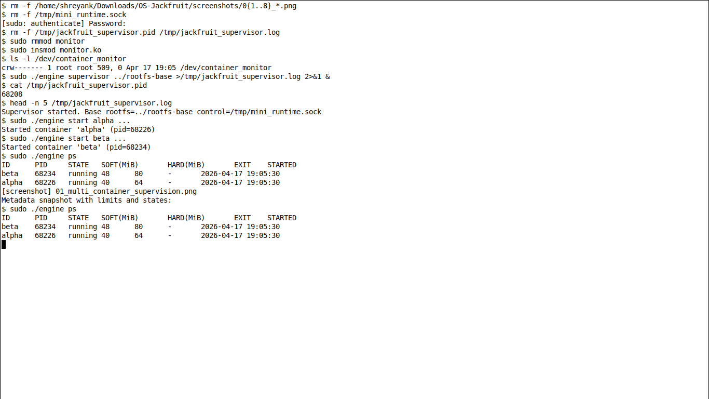
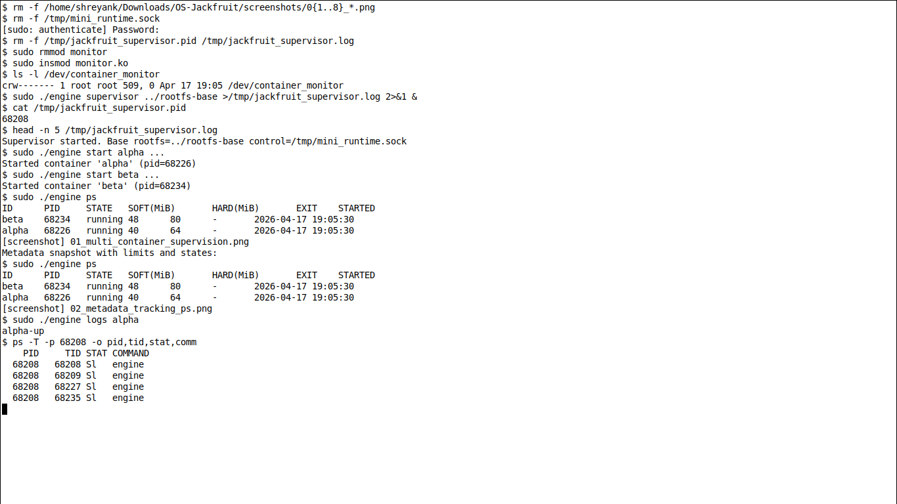
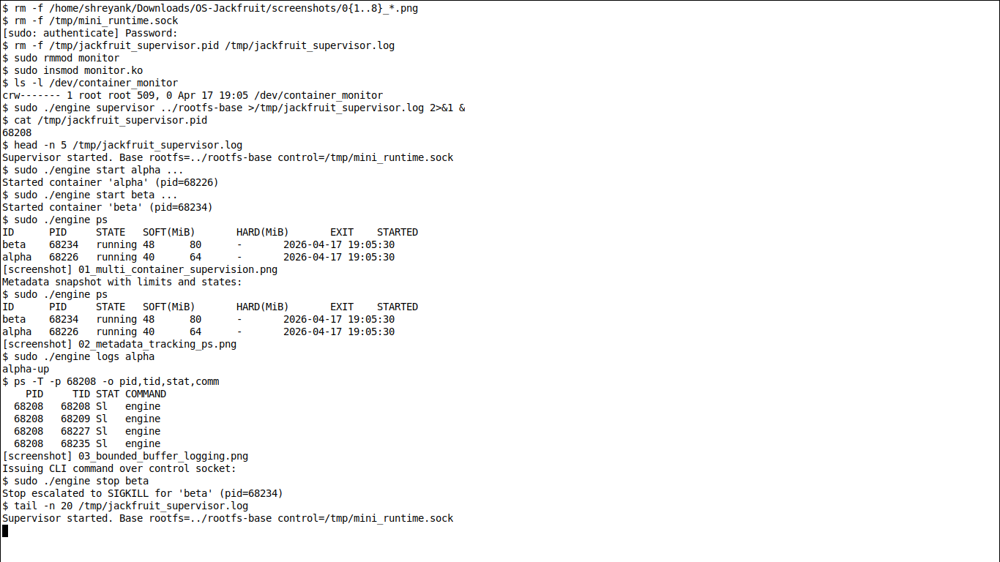
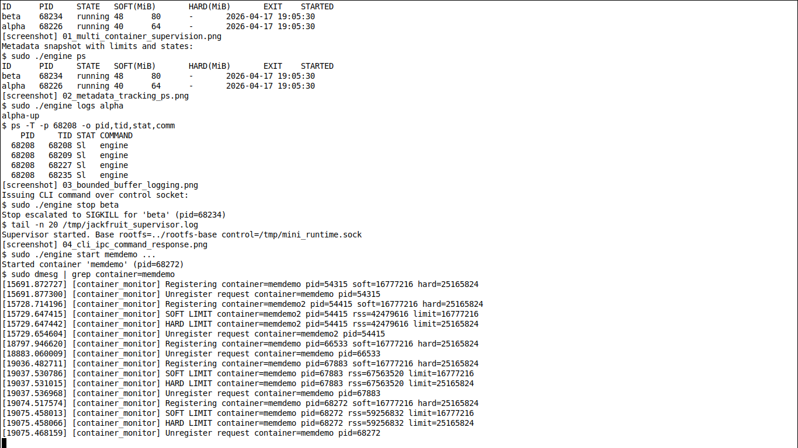
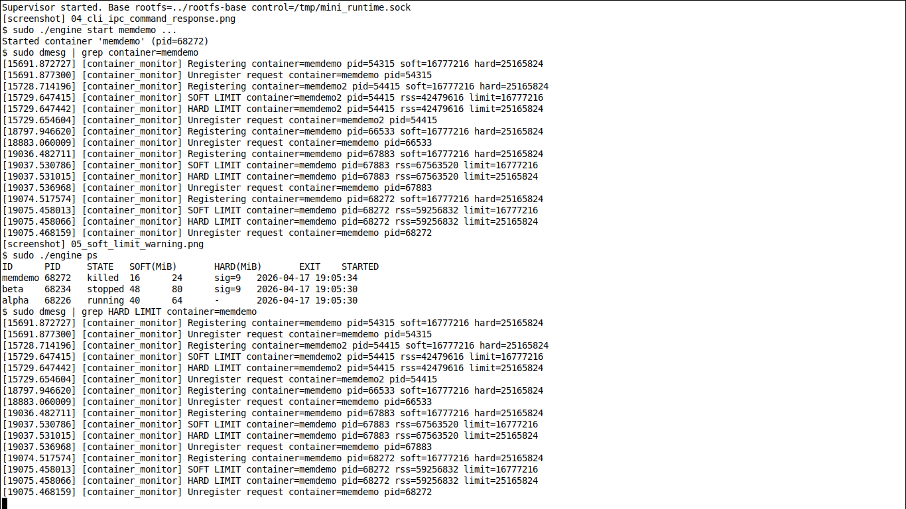
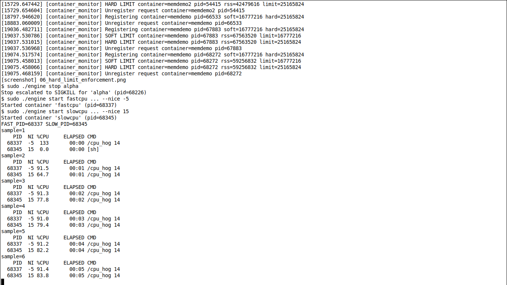
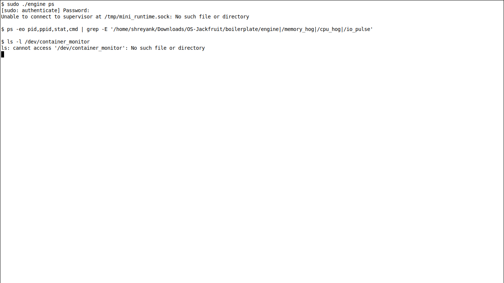

# OS Jackfruit (Rebuilt)

## Team
- Shreyank Sridhar (PES1UG24CS443)
- Shashank Arya (PES1UG24CS432)

This repository contains a clean, source-focused implementation of the multi-container runtime assignment.

## What Is Included

- `boilerplate/engine.c`
  - Long-running supervisor (`engine supervisor <base-rootfs>`)
  - CLI mode (`start`, `run`, `ps`, `logs`, `stop`)
  - Two IPC paths:
    - Control plane: UNIX socket (`/tmp/mini_runtime.sock`)
    - Logging plane: per-container pipes -> bounded producer/consumer queue -> `logs/<id>.log`
- `boilerplate/monitor.c`
  - Linux kernel module exposing `/dev/container_monitor`
  - `ioctl` register/unregister interface
  - Soft-limit warning + hard-limit SIGKILL enforcement based on RSS
- Workload helpers
  - `memory_hog.c`, `cpu_hog.c`, `io_pulse.c`
- Build and smoke CI
  - `boilerplate/Makefile`
  - `.github/workflows/submission-smoke.yml`

## Build

```bash
cd boilerplate
make ci
```

Prepare the runtime rootfs directories:

```bash
cd boilerplate
make rootfs
```

Build the kernel module:

```bash
cd boilerplate
make
```

Load the kernel module before testing memory-limit behavior:

```bash
cd boilerplate
sudo rmmod monitor 2>/dev/null || true
sudo insmod monitor.ko
ls -l /dev/container_monitor
```

## Run

Clean start (recommended before demos):

```bash
cd boilerplate
./engine shutdown 2>/dev/null || true
sudo pkill -f "./engine supervisor" 2>/dev/null || true
sudo rm -f /tmp/mini_runtime.sock
rm -rf logs
make ci
make rootfs
```

Start the supervisor from `boilerplate/`:

```bash
cd boilerplate
sudo ./engine supervisor ../rootfs-base
```

In another terminal:

```bash
cd boilerplate
./engine start alpha ../rootfs-alpha "/bin/sh -c 'echo alpha-up; sleep 5; echo alpha-done'"
./engine ps
./engine logs alpha
./engine stop alpha
```

Foreground run mode:

```bash
cd boilerplate
./engine run memdemo ../rootfs-beta "exec /memory_hog 80 12" --soft-mib 32 --hard-mib 48
```

CPU scheduling comparison:

```bash
cd boilerplate
./engine start fastcpu ../rootfs-alpha "exec /cpu_hog 14" --nice -5
./engine start slowcpu ../rootfs-beta "exec /cpu_hog 14" --nice 15
./engine ps
```

## Screenshot Evidence Commands

Run these commands and capture each screenshot immediately after the shown output.

For steps 5 and 6, ensure the kernel module is loaded:

```bash
cd boilerplate
sudo rmmod monitor 2>/dev/null || true
sudo insmod monitor.ko
ls -l /dev/container_monitor
```

### 1) Multi-container supervision

```bash
# terminal A
cd boilerplate
sudo ./engine supervisor ../rootfs-base

# terminal B
cd boilerplate
./engine start alpha ../rootfs-alpha "/bin/sh -c 'echo alpha-up; sleep 10; echo alpha-done'"
./engine start beta ../rootfs-beta "/bin/sh -c 'echo beta-up; sleep 10; echo beta-done'"
./engine ps
```



### 2) Metadata tracking (`ps`)

```bash
cd boilerplate
./engine ps
```



### 3) Bounded-buffer logging pipeline

```bash
cd boilerplate
./engine logs alpha
```



### 4) CLI + control IPC response

```bash
cd boilerplate
./engine stop beta
```



### 5) Soft-limit warning

```bash
cd boilerplate
./engine start memdemo ../rootfs-alpha "exec /memory_hog 80 12" --soft-mib 24 --hard-mib 64
sudo dmesg | tail -n 120 | grep -E "SOFT LIMIT|monitor:"
```



### 6) Hard-limit enforcement

```bash
cd boilerplate
./engine start memkill ../rootfs-beta "exec /memory_hog 120 15" --soft-mib 24 --hard-mib 32
sleep 2
sudo dmesg | tail -n 120 | grep -E "HARD LIMIT|monitor:"
./engine ps
```



### 7) Scheduling experiment

```bash
cd boilerplate
./engine start fastcpu ../rootfs-alpha "exec /cpu_hog 14" --nice -5
./engine start slowcpu ../rootfs-beta "exec /cpu_hog 14" --nice 15
sleep 2
ps -o pid,ni,pcpu,etime,cmd -C cpu_hog
```



### 8) Clean teardown

```bash
cd boilerplate
./engine shutdown || true
# fallback if supervisor is unresponsive:
sudo pkill -f "./engine supervisor" || true
sleep 1
ls -l /tmp/mini_runtime.sock || true
ps -ef | grep "./engine" | grep -v grep || true
sudo rmmod monitor || true
```



## CLI Contract

```bash
engine supervisor <base-rootfs>
engine start <id> <container-rootfs> <command> [--soft-mib N] [--hard-mib N] [--nice N]
engine run   <id> <container-rootfs> <command> [--soft-mib N] [--hard-mib N] [--nice N]
engine ps
engine logs <id>
engine stop <id>
engine shutdown
```

Defaults:
- `--soft-mib`: `40`
- `--hard-mib`: `64`
- `--nice`: `0`

## Notes

- Containers require root privileges (`clone` namespaces + `chroot` + mounts).
- Use unique writable rootfs directories per running container (`rootfs-alpha`, `rootfs-beta`, ...).
- `logs/` and build artifacts are ignored by `.gitignore`.
- Avoid running `make clean` while the supervisor is running; it removes build artifacts and can disrupt a live run. If CLI commands can’t connect, restart the supervisor.
